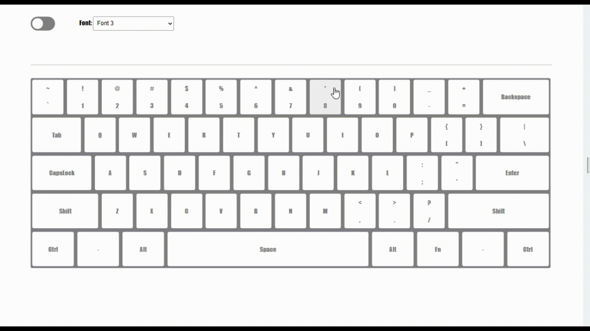

# 가상 키보드 ⌨️
[🖱️ 프로젝트 페이지 바로 가가 ](https://badahertz52.github.io/30projects_visual_keybord/)
## Index

### <a href="#info">1. 프로젝트 소개 </a>

### <a href="#study">2. 배운 것들</a>

- #### <a href="#web-pack">A.웹팩</a>
- #### <a href="#dark">B.다크 모드</a>
- #### <a href="#js-private">C. #과 JS 의 비공개 프로퍼티 </a>
- #### <a href="#js-constructor">D. JS 의 constructor 와 addEventListener </a>
- #### <a href="#js-bind">E. this와 bind </a>
- #### <a href="#js-boolean">F. el? 와 !!el의 차이 </a>
- #### <a href="#js-return">G. 함수와 if return </a>
- #### <a href="#keyboard">H. 윈도우에서 한글 자판과 keybordEvent </a>

---

## <div id="info">1. 프로젝트 소개 </div>

<📷 프로젝트 시뮬레이션>


<br/>

가상 키보드 프로젝트는 하나인 웹팩과 바닐라 자바스크립트를 사용해, 가상 키보드를 만들어 보는 프로젝트이다.

해당 프로젝트는 "30개 프로젝트로 배우는 프론트엔드 with React" 수업 중에 하나로 수업 내용에서 더 나아가 **한글 입력 시 오류를 수정하고 grid를 사용해 반응형 웹이 가능하도록 업데이트**를 진행했다.

---

## <div id="study">2. 배운 것들 </div>

### <div id="web-pack">A. 웹팩</div>

#### a. 웹팩이란 ?

모던 JavaScript 애플리케이션을 위한 정적 모듈 번들러로 프로젝트에 필요한 모든 모듈을 맵핑해 하나 이상의 번들을 생성한다.

#### b. 웹팩 설치

```
$ npm init -y
$ npm i -D webpack webpack-cli
```

### c. 웹팩 설정

프로젝트에 사용된 웹팩 설정을 공부하면서 webpack.config.js에 주석으로 공부한 내용을 정리했다.

[🖱️webpack.config.js 보러가기](https://github.com/BadaHertz52/30projects_visual_keybord/blob/master/webpack.config.js)

### <div id="dark">B. 다크 모드</div>

root element이 html 요소의 스타일을 통해 다크 모드를 실행 할 수 있습니다.

```css
/* html 의 theme 속성이 dark-mode 일 때 */
html[theme="dark-mode"] {
  filter: invert(100%) hue-rotate(180deg);
}
```

- filter :흐림 효과나 색상 변형 등 그래픽 효과를 요소에 적용
- invert :색조를 보색으로 변경
- hue-rotate : 색조(hue)를 변경

여기서 의문점은 invert를 통해서도 밝은 색과 어두운 색으로 변경하는 다크모드를 실행할 수 있는데 왜 hue-rotate를 설정해야할까?

그 의문에 대한 답은 검정,흰색외의 색에 대해 invert는 붉은 색이 푸른 계열의 색으로 변경되듯이 보색을 색이 변경되기 떼문에 밝은 것은 어둡게 변경되기를 기대하는 다크모드를 invert만으로 실행하기에는 아쉬운 점이 있다.hue-rotate(180deg)를 하면, 노란 색을 보다 어두운 톤의 노락색으로 변경할 수 있기 때문에 hue-rotate(180deg)를 같이 사용할때 보다 나은 다크모드를 실행할 수 있다.

### <div id="js-private">C. #과 JS 의 비공개 프로퍼티 </div>

자바스크립트는 객체 외부에서 접근이 가능한 공개 프로퍼티와 불가능한 비공개 프로퍼티가 있다.

비공개 프로퍼티를 구현하는 방법으로는 클로저 함수(선언될 당시의 환경을 기억하는 함수)가 있다는 것을 알고 있었지만, #을 통해서도 구현할 수 있다는 것을 알게 됐다.

```js
export class Keyboard {
  #switchEl;
  #fontSelectEl;
  #containerEl;
  #keyboardEl;
  #inputGroupEl;
  #inputEl;
  #keyPress = false;
  #mouseDown = false;
  constructor() {
    this.#assignElement();
    this.#addEvent();
  }
}
const keyboard = new Keyboard();
console.log(keyboard.#switchEl);
// SyntaxError: Private field ‘#switchEl’ must be declared in an enclosing class
```

keyboard 가 Keyboard 클래스를 이용해 만들어진 객체라 해도, **비공개 프로퍼티는 클래스 선언 자체내에서만 접근가능**하기 때문에 콘솔에는 에러가 뜬다.

### <div id="js-constructor">D. JS 의 constructor 와 addEventListener </div>

자바스크립트의 class의 constructor는 클래스의 인스턴스를 생성하고 클래스 필드를 초기화하기 위한 특수한 메서드라고는 알고 있었지만, constructor안에서 이벤트 리스너를 등록할 수 있다는 것은 이번 프로젝트를 하면서 알게 되었다.

```js
class Button {
constructor(element) {
 this.element = element;
	this.element.addEventListener(‘click’, this.handleClick.bind(this));
 }
 handleClick() { console.log(‘Button clicked!’); }
}
 const button = new Button(document.getElementById(‘button’));
```

### <div id="js-bind">E. this와 bind </div>

이벤트 리스너로 등록한 함수에서 this는 이벤트를 발생시킨 요소를 의미한다.

```js
export class Keyboard {
  constructor() {
      this.#addEvent();
    }
  #addEvent(){
  	document.addEventListener("keydown", this.#onKeyDown.bind(this));
  }
  #onKeyDown(){ ...
  }
}
```

그런데,this.#onKeyDown는 이벤트를 발생시키는 document가 아닌 Keyboard 클래스 내의 #onKeyDown함수를 말하는 것이기 때문에, 함수의 this를 원하는 값으로 고정시키는 bind 메서들르 사용해 this를 Keyboard 클래스로 고정시켜야 한다.

### <div id="js-boolean">F. el? 와 !!el의 차이 </div>

!!연산자는 어떤 값의 불리언 값에 대해 표현할 때 사용할 수 있다.

```js
const x = "";
console.log(!!x); // false
```

그렇다면 다음 코드에서 el?.classList 와 !!el?.classList의 차이는 무엇일까?

```js
const el = document.querySelector("div");
const x = el?.classList;
const y = !!el?.classList;
```

**반환하는 값**이 서로 다르다.

| case/반환값                         | x            | y     |
| ----------------------------------- | ------------ | ----- |
| el === null                         | undefined    | false |
| el !==null, classList === undefined | undefined    | false |
| el !==null, classList !== undefined | DOMTokenList | false |

!!el?.classList는 el?.classList의 값에 따라 해당 값을 다시 불리언값으로 변형한 값을 반환한다.

```js
const a = el?.classList.contains(".test");
const b = !!el?.classList.contains(".test");
```

위에서 a는 boolean 또는 undefined (el나 classList가 정의되지 않았을때)의 값을 가지지만, b는 boolean의 값만 가진다.

### <div id="js-return">G. 함수와 if return </div>

함수에서 return은 함수의 실행을 종료시키고 반환값이 존재한다면 이를 반환하는 역할을 한다.

만약, 조건에 따라 함수의 실행을 종료하고 싶다면 **if(조건)return** 을 사용하면 된다.

```js
  #onMouseUp(event) {
    // this.#keyPress가 참일때 (키보드 입력이 있을 경우) onMouseUp(mouse up 일때 실행하는 함수)함수 실행 종료
  if (this.#keyPress) return;
  ....
  }
```

### <div id="#keyboard">H. 윈도우에서 한글 자판과 keybordEvent</div>

해당 프로젝트는 오직 영문 자판만을 지원하기 때문에 한글 자판 입력 시, 입력 값을 보여주기 않고 "한글 입력 불가"라는 오류 메세지를 보여준다.

수업에서는 한글 자판 입력을 감지하는데 다음과 같은 정규식을 사용했다.

```js
/[ㄱ-ㅎ|ㅏ-ㅣ|가-힣]/.test(event.key);
//event: keydown 시의 event
```

그러나 문제는,맥 운영체제와 다르게 **윈도우 운영체제에서는 한글 자판을 눌렀을때, key 값이 한글 자판과 일치하지 않다는 것이 였다.**

한글은 자음과 모음을 조합해서 사용하기 때문에 브라우저에서 한글 입력을 처리하는 과정을 거치기 때문에 한글 자판을 눌렀을 때 key 값이 "Process"가 된다.

자판을 눌렀다 땠을때, 즉 keyUp event 에서의 key 값은 한글로 나올까 싶었는데 이때는 한글 자판이 있는 위치의 영문이 key 값으로 나왔다.

따라서 맥과 윈도우 운영체제에서 모두 한글 자판을 감지할 수 있도록, 기존의 정규식의 결과가 참이거나 key 값이 Process 일 경우 한글 자판 입력일때의 코드를 실행할 수 있도록 코드를 수정했다.
